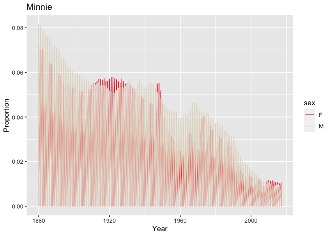

Babies!!
================

## GitHub Documents

This is an R Markdown format used for publishing markdown documents to
GitHub. When you click the **Knit** button all R code chunks are run and
a markdown file (.md) suitable for publishing to GitHub is generated.

## Baby Code

You can include R code in the document as follows:

``` r
library(ggplot2)
library(dplyr)
```

    ## 
    ## Attaching package: 'dplyr'

    ## The following objects are masked from 'package:stats':
    ## 
    ##     filter, lag

    ## The following objects are masked from 'package:base':
    ## 
    ##     intersect, setdiff, setequal, union

``` r
library(babynames)

babynames %>% 
  filter(name == "Minnie") %>% 
  group_by(name)
```

    ## # A tibble: 211 × 5
    ## # Groups:   name [1]
    ##     year sex   name       n      prop
    ##    <dbl> <chr> <chr>  <int>     <dbl>
    ##  1  1880 F     Minnie  1746 0.0179   
    ##  2  1880 M     Minnie     9 0.0000760
    ##  3  1881 F     Minnie  1653 0.0167   
    ##  4  1881 M     Minnie     8 0.0000739
    ##  5  1882 F     Minnie  2004 0.0173   
    ##  6  1882 M     Minnie    10 0.0000820
    ##  7  1883 F     Minnie  2035 0.0170   
    ##  8  1883 M     Minnie    14 0.000124 
    ##  9  1884 F     Minnie  2243 0.0163   
    ## 10  1885 F     Minnie  2178 0.0153   
    ## # … with 201 more rows

## Baby Plot

You can also embed plots, for example:

<!-- -->

Note that the `echo = FALSE` parameter was added to the code chunk to
prevent printing of the R code that generated the plot.
